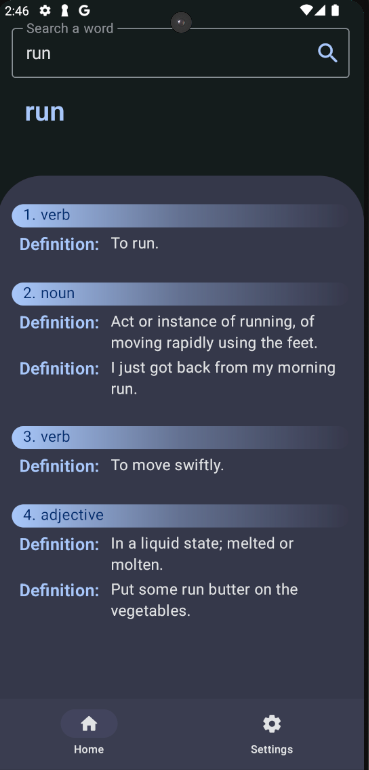
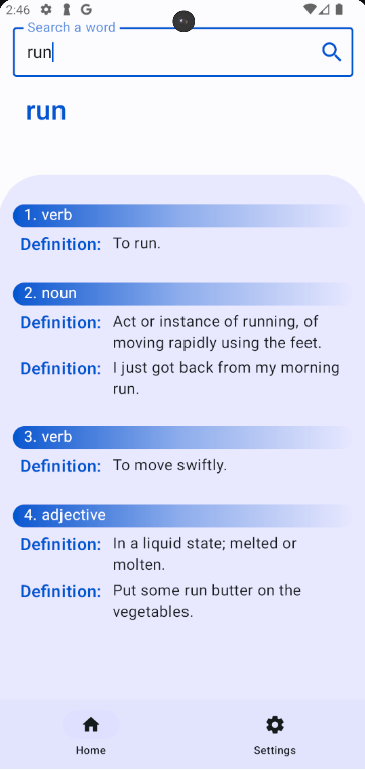

# Dictionary application made with Kotlin and jetpack compose using MVVM architecture

This application is made by using MVVM architecture pattern and it uses this api:
https://dictionaryapi.dev/

## Screenshots

Dark theme image of the application

Light theme image of the application

